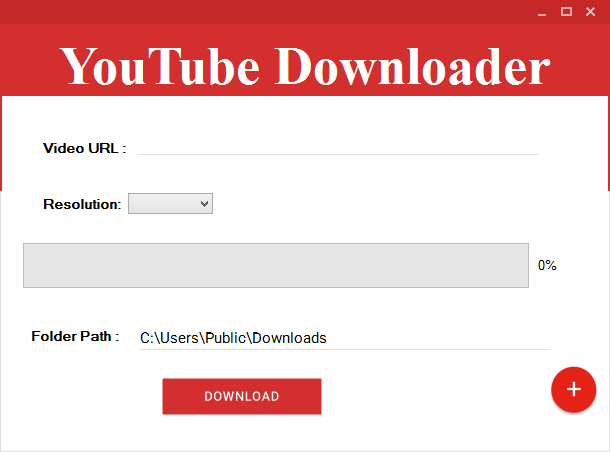
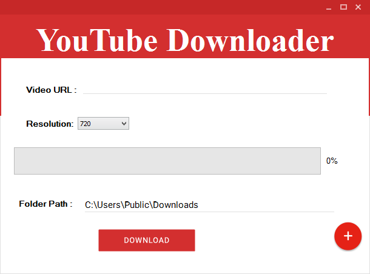
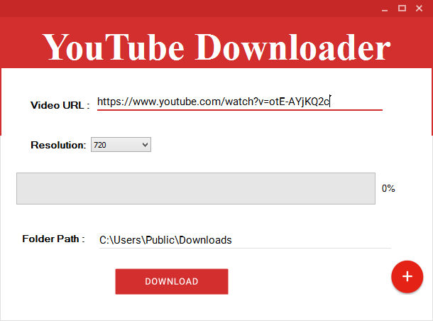
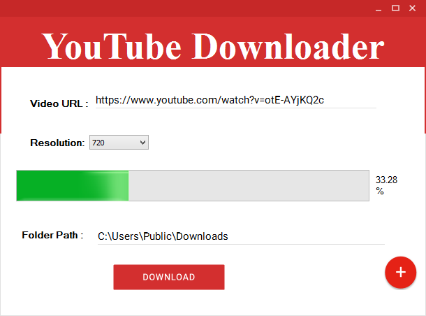

 

# YouTube Downloader Material Design
## *`C# Microsoft Visual Studio (2017&2015)`*
<!--## *`C# Microsoft Visual Studio (2017&2015&2013)`*-->
## ***``Windows OS Desktop PC``*** 

 

***
## The Prerequisites are Required: Loading Preview   
## **`Microsoft .NET Framework 4.5`**
***
A Simple Youtube videos downloader using <a href="https://www.nuget.org/packages/YoutubeExtractor" >YoutubeExtractor</a> Package With windows forms , the YouTubeDownloader has a beautifull material design ui components.

## NuGet
[YoutubeExtractor at NuGet](http://nuget.org/packages/YoutubeExtractor)
    Install-Package YoutubeExtractor
### Some Screenshots

***
# FFmpeg Builds
**FFmpeg is the leading multimedia framework to decode, encode, transcode, mux, demux, stream, filter and play. All builds require at least Windows 7. Nightly git builds are licensed as GPL 3.0, and release build are licensed as GPL 3.0 and LGPL 3.0. LGPL 3.0 release builds can be found using the "All Builds" links.**

| Version | Architecture | Linking |
|---------|--------------|---------|
|  4.2.1  | [Download Build  (*.exe & .dll*) Windows 32-bit](https://ffmpeg.zeranoe.com/builds/win32/shared/ffmpeg-4.2.1-win32-shared.zip) |  Shared |
|  4.2.1  | [Download Build  (*.exe & .dll*) Windows 64-bit](https://ffmpeg.zeranoe.com/builds/win64/shared/ffmpeg-4.2.1-win64-shared.zip) |  Shared |

***
## Other Downloads
[Download All FFmpeg Builds](https://ffmpeg.zeranoe.com/builds/#)
